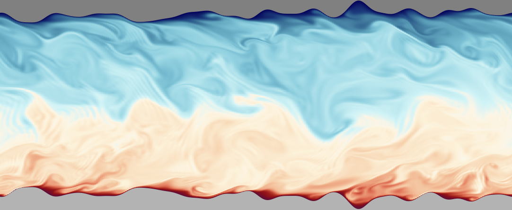

# DNS-Supercritical-IBM
Multi-GPU DNS solver for (turbulent) supercritical flows affected by rough surfaces and buoyancy.

## Key features:
* Written in modern Fortran, with OpenACC+MPI for cross-platform GPU support.
* Compatible with NVIDIA/AMD GPUs, or multicore CPU runs.
* Fast Poisson solver (FFT-based) embedded with a parallel tridiagonal solver.
* State-of-the-art scalability in multi-GPU simulations for MPI domains with various types of decompositions (2D pencils, 1D slabs, etc.).
  - Edge cases discussed in previous work are supported:
    - Rafael Diez, Jurriaan Peeters, Pedro Costa. A pencil-distributed finite-difference solver for extreme-scale calculations of turbulent wall flows at high Reynolds number. Computer Physics Communications, vol. 316, p. 109811, 2025. (https://www.sciencedirect.com/science/article/pii/S0010465525003133)
* Full post-processing code to calculate the shear stresses and heat fluxes of rough surfaces.
* Organized workflow with automated tasks (pre- and post-processing).
* Optimized halo exchanges for the immersed boundary method (IBM). 
  - Additional interpolation points (beyond regular halo exchanges) are identified and transferred selectively (not entire layer). 
  - The specialized module (`diezdecomp_api_ibm.f90`) extends the diezDecomp library (https://github.com/Rafael10Diez/diezDecomp) to perform this task. 
    - Exhaustive synthetic tests with random numbers can be found in the directory: `tests/test_poisson_solver_and_ibm_rand`.

## Examples
- Please see the `examples` folder to check how the code is used for various use cases:
    - `input_Wan_2025_Case_A_as_roughsurf`: Supercritical flows with pseudo-boiling, using rough surface formulation (flat).
        - Reference: T. Wan , X. Wang , Y. Jin and P. Zhao (2025). Effects of large density variations on near-wall turbulence and heat transfer in channel flow at supercritical pressure. (https://doi.org/10.1017/jfm.2025.193)
    - `input_Nicoud_2000_Tr_4`: Gas-like flows with variable-properties.
        - Reference: F. Nicoud (2000). Conservative High-Order Finite-Difference Schemes for Low-Mach Number Flows. (https://www.sciencedirect.com/science/article/pii/S0021999199964082)
    - Turbulent flows past rough surfaces:
      - Incompressible formulation: `input_Ret540_Pr1_k45_gritblasted_incomp`
      - Incompressible flow, but using variable-property formulation:`input_Peeters_Sandham_Ret180_Pr1_k30_gritblasted_as_varprop`.
      - Reference: J. Peeters, N. Sandham (2019). Turbulent heat transfer in channels with irregular roughness. (https://www.sciencedirect.com/science/article/pii/S0017931018353456)

# How to use

## Compilation
  - Only standard Fortran files must be compiled. The main requirements are access to: OpenACC, GPU-aware MPI support, and the applicable FFT library (cuFFT, hipFFT or FFTW3).
  - Compilation flags:
    - `_OPENACC`: Flag automatically defined by the compiler when OpenACC is enabled (e.g, by compiling with `-acc`).
    - Selection of FFT library for Poisson solver (FFTW3, cuFFT, or hipFFT):
      - FFTW3: enable `_USE_FFTW` (CPU only).
      - hipFFT: enable `_USE_HIPFFT` (AMD architectures).
      - cuFFT: default for GPU runs (`_OPENACC` flag enabled) (NVIDIA GPUs).
    - `_BIN_REDUCTION`: Enable binary reduction to process averaged 3D arrays.
      - Used to circumvent compiler difficulties (in older architectures/drivers) with OpenACC reduction kernels.
      - It is recommended to leave this flag enabled.
  - Summary for every architecture:
    - Multicore CPU runs:
      - OpenACC must be disabled by passing the flag `-hnoacc`, or equivalent.
      - The compiler must have access to MPI (`-lmpi`) and the FFTW3 library (`-lfftw3`).
      - The compilation flag/macro `_USE_FFTW` must be active as well.
    - For GPU-based simulations:
      -  OpenACC must be enabled in the compiler, and a GPU-aware MPI library is also needed (`-lmpi`). Additionally:
         - For NVIDIA GPUs, the code must be compiled with the cuFFT library (enabled by default for GPUs).
         - For AMD GPUs, the CRAY compiler must be called using `hipfort` and with access to the `hipfft` library. The flag/macro `_USE_HIPFFT` is necessary to replace cuFFT calls with hipFFT.
  - Please see the compilation example in `examples/compile_lumi.txt` and `examples/slurmjob_lumi.slurm`.

## Case files
To run a DNS case, the code expects to find a parent folder with the following structure: 
* `./input`
    * Contains the input DNS data:
       - Height function for rough surfaces:
           - `rough_surf_define.py` (Python version)
           - `rough_surf_define.f90` (Fortran version).
           - Any additional input files read by Python/Fortran must be stored in `./input/fortran_surf_files` (please see examples folder).
       - Input parameters (`param.txt`):
           - Time step, domain size, number of iterations, etc. (please see guidelines below)
       - 3D arrays with the initial state of the DNS solver:
           - `array_ini_[U/W/V].dat` (streamwise/spanwise/wall-normal velocity)
           - `array_ini_T.dat` (temperature field)
           - `array_ini_P_now.dat` (current pressure field) (not needed for incompressible flows)
           - `array_ini_P_old.dat` (previous pressure field) (not needed for incompressible flows)
       - Grid in the wall-normal direction (`yu.txt`)
           - Due to the complexity of DNS, it is recommended to pre-compute this grid, using the recommended strategies for each application.
           - Standard formulas use hyperbolic tangent functions. However, for rough surfaces, it might be preferable to use a region with uniform spacing near the walls, followed by another region with a small growth ratio (`1%` or `2%`) towards the channel center.
       - `expressions_rho_mu_cond_buoyancy_cp_div_jacobian.f90`
          - Arithmetic formulas used to compute the thermodynamic properties of the code, as a function of the local fluid temperature. 
             - The user can consider any type of formula (splines, standard EOS, etc.).
             - To convert `scipy` splines into GPU kernels, the full source code is provided in: `examples/gen_splines_CO2`.
          - The code uses Fortran `include` statements to transform the code in `expressions_rho_mu_cond_buoyancy_cp_div_jacobian.f90` into GPU kernels.
       - `avg_variables.txt`:
          - Input file indicating which variables to user wishes to average (as **3D arrays**).
             - The format for the saved variables is: `[saved_name] => [arithmetic_formula]`.
                - For example, to compute the average velocity, the user can define `U_avg => (U(i,j,k))`.
                - The right-hand-side expression (`[arithmetic_formula]`) is executed inside a GPU kernel.
            - The pre-processing Python script uses meta-programming to automatically allocate the new variables, define the GPU kernels, output the results, etc.
            - When running the DNS calculations, the results of the averaged variables are stored in the `runtime/avg` directory.
            - The variables to control the output frequency of the DNS solver are explained below (Data Collection Section).
       - `prof_1d_variables.txt`:
          - Input file indicating the variables that the user wishes to average as **1D profiles** along the wall-normal direction (`y`). 
          - The file format and guidelines are identical to `avg_variables.txt`, in the sense that all expressions have the form: `[saved_name] => [arithmetic_formula]`.
             - The Python pre-processing routines use meta-programming to schedule all the relevant operations (memory allocation, computations, saving).
          - The only difference is that the results are saved in the `./runtime/prof_1d` directory.
* `./runtime`
    - Contains a copy of all source files in the subfolder `src` of this repository.
    - All executables are compiled inside `runtime` (keeping copies of the original files).
    - The results of post-processing scripts are also stored in this folder (`runtime`).
    - Please note that, before compiling, the script `./runtime/pycode/calc_bands.py` is (automatically) called to generate the finite difference stencils of the DNS solver, the IBM coefficients, etc.
        - All this data is stored inside the `runtime` folder as well.
        - Note that the IBM coefficients are generated by an internal Fortran code, which is automatically compiled and called by `calc_bands.py`.

More details about the usage of the code can be found in the `examples` directory, and the respective documentation. 

In general, the `runtime` folder is configured automatically. The user is only responsible for adapting the provided scripts to compile the code, and call the relevant Python scripts.

## Data Collection (post-processing)

- As mentioned above, the code stores all averaged 3D arrays in the `avg` directory, and all 1D profiles in the `prof_1d` directory.
- The output frequency for both the 1D and 3D averaging are controlled by the variables `avg_iter_start`, `avg_nraw`, `avg_freq` and `avg_bin_nbins` (in `input/param.txt`) :
     - `avg_iter_start` is the iteration to begin averaging the results.
     - `avg_nraw` is the number of snapshots averaged directly (summing).
     - `avg_freq` is the sampling frequency for averaging snapshots (e.g., `avg_freq = 3` only calls the averaging procedure every 3 iterations.)
     - `avg_bin_nbins` is a more advanced feature. When millions of snapshots are averaged, to avoid losing decimal precision, the code uses a binary-tree averaging procedure to compute the average without losing precision. `avg_bin_nbins` is the number of branches in the binary tree. Please note that the code is optimized to only store `avg_bin_nbins` additional arrays in the CPU memory.
  - Therefore, the total number of iterations considered in the averaging procedure is `(2^avg_bin_nbins)*avg_freq*avg_nraw`.
- To save instantaneous 3D snapshots, the following input parameters can be configured (in `param.txt`):
   - `snap_iter_start`: CFD iteration to start saving flow snapshots.
   - `snap_freq`: sampling frequency of the flow snapshots.
   - All results are automatically saved in the `runtime/end` sub-folder.
   - Note: An instantaneous snapshot of the last time step will always be saved, since this is necessary to continue iterating (in clusters) once a slurm-job finishes running.

## Advanced post-processing (local skin friction factors and Nusselt numbers)
- To compute the skin friction factors and Nusselt numbers in rough surfaces:
  - The subfolder 'runtime/code_interp_ftr' contains all the required interpolation code for the wall quantities.
  - The interpolation is written purely in Fortran to ensure high processing speed.
     - The finite element shapes considered for interpolation are described in:
       - Rafael Diez Sanhueza , Ido Akkerman , Jurriaan W.R. Peeters (2023). Machine learning for the prediction of the local skin friction factors and Nusselt numbers in turbulent flows past rough surfaces.
  - Tecplot files with the interpolated results will be generated automatically after executing the Linux script in: `commands.txt`.
 
- Additional:
  - The interpolation code also includes two secondary scripts:
    - `mk_fav_avg.py`:
      - This Python script uses meta-programming to compile & launch a Fortran executable that computes 3D Favre-averaged quantities using the data in `runtime/avg`.
    - `only_prof1d.py`:
        - This code is used to convert the 3D-averaged arrays in the `avg` folder into 1D profiles (along the wall-normal direction).
          - The results are stored in the subfolder: `runtime/prof_1d_from_avg3d`.
        - Relevance:
          - For Favre-averaged quantities, the density appears in the denominator of the averaging procedure. Therefore, the results are different depending on whether the density is considered as a time-averaged 3D array, or a unique 1D profile for the entire channel. In other words, the results of these two formulas are different:
            - `spatial_avg(time_avg(rho*[quantity])/time_avg(rho))` (correct)
            - `spatial_avg(time_avg(rho*[quantity]))/spatial_avg(time_avg(rho))` (incorrect).
               - For rough surface simulations, data points at the same y-coordinate can operate under different physical conditions (e.g., upwind or recirculation zone). Thus, considering an averaged density for all points at the same y-location is inaccurate for flows with variable density.

## Flow control flags

- `bulk_use_target_Ub`: enable DNS runs with fixed streamwise velocity (flag with `0/1` value).
   - Parameter `bulk_target_Ub` specifies the target velocity.
- `bulk_use_target_Reb`: enable DNS runs with fixed Reynolds number (based on the streamwise velocity) (flag with `0/1` value).
   - Parameter `bulk_target_Reb` specifies the target Reynolds number.
- `bulk_use_rho_weighting`: use mass-weighted (`1`) or volume-weighted (`0`) bulk quantities (flag with `0/1` value).
- Mechanism to enforce the flow velocity or Reynolds number (flags with `0/1` value):
  - `force_Sf_x_semilocal`: compute the mean pressure-gradient (`dPdx`, double) considering a semilocal density (averaged across the y-direction) instead of the local (3D) density. (This technique is common in classical supercritical flow studies).
  - `force_Sf_x_pressure`: compute a mean pressure gradient (`dPdx`, double) that enforces the target flow velocity, using the local (3D) density field.
  - `force_Sf_x_accel`: define a variable gravity/acceleration (`gx`, double) that enforces the target flow velocity.

## Utilities

- `misc/reinterp`: Re-interpolate DNS data between different cases
  - `misc/reinterp/mk_ini_data_sparser_bin.py`: Python script to be called when reinterpolating DNS data.
    - Relevance:
      - DNS data must be transferred between folders when the grid size is changed, etc. 
      - Additionally, initializing a DNS run using the closest DNS data available can massively reduce the simulation times (e.g., use incompressible flow data at a similar Reynolds number).
    - Steps:
       1) Copy `mk_ini_data_sparser_bin.py` to the input DNS folder.
       2) Call `python3 mk_ini_data_sparser_bin.py [older_folder]`.
       3) The data from `[older_folder]` will be re-interpolated. If rough surfaces are defined, the data will be re-mapped taking them into account.

##  Guidelines for `param.txt` file
- `integer nx/nz/ny`: Grid points in streamwise/spanwise/wall-normal     directions.
- `double Lx/Lz/Ly`:  Channel size in streamwise/spanwise/wall-normal    directions.
- `integer use_rough_surf`:        Use rough surface formulation? (0/1)
- `integer use_rough_surf_quady`:  Use quadric rough surface? (0: ghost     points,1: quadratic upwind coefficients)
- `double dtmax`:                  Time step
- `double Ret`:  Friction Reynolds number
- `double Pr`:  Prandtl number
- `double Gb_x/Gb_z/Gb_y`: Buoyancy multiplier in streamwise/spanwise/wall-normal direction (scalar, multiplies buoyancy_arr)
- `double Sf_x/Sf_z`: Constant mean-pressure-gradient in streamwise/    spanwise direction.
- `double Sq`  : Constant volumetric heat source 
- `integer nreps_x/nreps_z`: Surface repetitions in x/z-direction     (advanced, please leave as 1).
- `integer bulk_nprint`: Iteration printing frequency
- Velocity control schemes (optional):
  - `integer bulk_use_target_Ub`: Use forced bulk velocity ($U_b$)? (0/1)
  - `double bulk_target_Ub`: Forced bulk velocity value (if     `bulk_use_target_Ub==1`)
  - `integer bulk_use_target_Reb`: Use forced bulk Reynolds number     ($Re_b$)? (0/1)
  - `double bulk_target_Reb`: Forced bulk Reynolds number (if     `bulk_use_target_Reb==1`)
  - `integer bulk_use_rho_weighting`: Density-weighted bulk velocity?   (0/  1)
- Mechanism to enforce target velocity (or Reynolds number):
  - `integer force_Sf_x_pressure`: Enforce $U_b$ (or $Re_b$) with     mean-pressure-gradient (dPdx) along x-axis? (0/1)
  - `integer force_Sf_x_semilocal`: Enforce $U_b$ (or $Re_b$) computing   dPdx   using   pre-averaged 1D density profiles? (0/1)
  - `integer force_Sf_x_accel`: Enforce $U_b$ (or $Re_b$) with streamwise     gravity/acceleration? (0/1)
- Early instability filtering (DNS initialization):
   - Motivation:
        - When highly turbulent DNS cases are initialized with low-quality guesses, the code includes a filtering procedure to improve convergence (for a few hundred iterations).
        - However, the filtering procedure must be turned off as soon as possible. The convergence of the DNS solver must be monitored **after** the filtering procedure is disabled, and the turbulence statistics should only be sampled after a steady-state is reached. The final results should never be influenced by the filtering procedure.
    - Parameters:
      - `integer filtering_first`: Iteration to start filtering.
      - `integer filtering_steps`: Filtering frequency (when active).
      - `integer filtering_nstop`: Last iteration to stop filtering (hard-coded) (it should be as soon as possible)
- Averaging parameters:
  - `integer avg_iter_start`: Iteration to start averaging
  - `integer avg_nraw`: Number of averaged iterations as a flat sum (`sum(...)/n_samples`)
  - `integer avg_freq`: Sampling frequency for averaging
  - `integer avg_bin_nbins`: Depth of binary tree to average arrays     losing less decimal precision.
  - `integer prof_1d_avg_use`: Compute averaged 1D profiles?     (recommended to use `1`)
- Save snapshots:
  - `integer snap_iter_start`: Iteration to start saving flow snapshots
  - `integer snap_freq`: Frequency to save flow snapshots
  - `integer use_incompressible`: Use incompressible flow formulation?
- Boundary conditions:
  - `double wall_BC_[U/V/W/T]_[top/bot]`: Top/bottom wall velocity component (`U/V/W`) or temperature (`T`):
    - Note: for velocity components, only zero is supported for now     (`wall_BC_[U/V/W]_[top/bot] = 0`).
- `integer use_utau_work`: Use velocity-induced work in the energy equation? (deprecated feature due to focus on low-Mach number flows, please leave disabled as 0).
